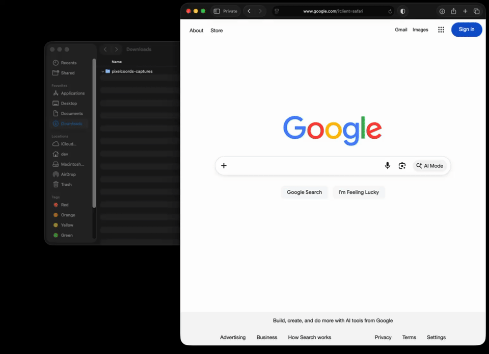

<h1 align="center">pixelcoords</h1>

<p align="center">
  <b>Freeze your screen, mark regions, get pixel-exact coordinates and crops</b><br/>
  <i>Rectangles, ellipses, triangles, N-gons, freehand — rotate, label, verify, regenerate</i>
</p>

<p align="center">
  <a href="https://github.com/nolindnaidoo/pixelcoords/actions/workflows/ci.yml">
    
  </a>
  <a href="https://crates.io/crates/pixelcoords">
    
  </a>
  <a href="LICENSE">
    
  </a>
</p>

<!-- Demo GIF goes here once recorded:
<p align="center">
  
</p>
-->

Every screen tool that measures pixels ends at a human's eyeball: a
ruler shows you a number, a screenshot app draws an arrow, a mouse
tracker prints a position you copy by hand. pixelcoords starts from a
different premise — **the real consumer of a coordinate is a machine.**

It freezes your screen so nothing moves while you measure, then lets you
mark regions with real shapes — rectangles, ellipses, triangles, N-gons,
freehand — rotated, labeled, and placed to the exact pixel with a loupe
and arrow-key nudging. What you mark becomes data, not a picture:
versioned JSON in physical pixels with per-monitor DPI scale, labeled
crops and frame-sized cutouts, ready-to-paste click code for your
automation stack, point verification with exit codes for CI and
computer-use agents, and self-healing re-location when the UI drifts out
from under your coordinates. Sessions reopen and edit like documents.

No account, no network, no toolkit — one small native binary for macOS,
Windows, and Linux. MIT-licensed, because the aim was to build the best
tool in this category and give it away.

## Install

```bash
cargo install pixelcoords
```

Rust 1.88+. On Linux, build dependencies first:

```bash
sudo apt-get install -y libxcb1-dev libxcb-randr0-dev libpipewire-0.3-dev \
  libclang-dev libegl1-mesa-dev libgbm-dev pkg-config
```

macOS asks for Screen Recording permission on first run —
[docs/TROUBLESHOOTING.md](docs/TROUBLESHOOTING.md) covers it.

## Sixty seconds

```bash
pixelcoords                      # screen freezes; drag shapes, A labels, S saves
# → Downloads/pixelcoords-captures/<timestamp>/
#   session.json  screenshot-0.png  cutout-primary-0.png  cutout-inverse-0.png  crop-0-submit.png

pixelcoords assert --session <dir> --point 812,440 --label submit
# exit 0: that point is inside the region you labeled "submit"

pixelcoords emit --session <dir> --format pyautogui
# ready-to-paste click code, coordinate conventions already handled

pixelcoords find --session <dir>
# the UI moved? every region re-located by its saved crop, deltas included

pixelcoords resume                # pick any saved session, keep editing it
```

Window-relative marking: `--target "Title"` on macOS/Windows/X11, or
`--pick` on Wayland. Every command speaks exit codes and JSON where a
script would care — the complete reference with every flag is
[docs/CLI.md](docs/CLI.md).

## Controls

Drag draws; the on-screen panel teaches everything else. The six that
matter: `W` cycles the tool, `A` labels, `S` saves, `Z` undoes, hold `M`
for a pixel loupe, `Esc` backs out / quits. Full table in
[docs/CLI.md](docs/CLI.md); every key is rebindable via
[docs/CONFIGURATION.md](docs/CONFIGURATION.md).

## Platform status

| Platform | State |
|----------|-------|
| macOS | Supported — primary development platform |
| Windows | Supported — verified by hand on Windows 11 |
| Linux (X11) | Supported — verified by hand on GNOME 46; every feature works |
| Linux (Wayland) | Screen coordinates + `--pick` window marking — verified by hand on GNOME 46; no `windows` / `--target` (the protocol withholds window geometry) |

Multi-monitor and mixed-DPI layouts are exercised by tests but not yet
verified on real hardware. This table is kept honest — claims match runs.

## Non-goals

Knowing what a tool is means knowing what it isn't. These are settled:

- **OCR** — text extraction is a different product; platform tools and
  Shottr own it.
- **Live (unfrozen) measurement** — the freeze *is* the thesis: nothing
  moves between look and click.
- **Annotation** — arrows, blur, and highlights are a screenshot
  editor's job; labels here exist for machines, not slides.
- **Recording / GIF capture** — the product is the frozen instant, not
  the timeline; ShareX exists.
- **Cloud upload, sharing, accounts** — offline by design, permanently.

## Documentation

- [docs/CLI.md](docs/CLI.md) — every command, flag, control, and exit code
- [docs/OUTPUT.md](docs/OUTPUT.md) — session.json schema, crops, cutouts, jq recipes
- [docs/CONFIGURATION.md](docs/CONFIGURATION.md) — colors, key bindings, config file
- [docs/TROUBLESHOOTING.md](docs/TROUBLESHOOTING.md) — fixes, behaviors, FAQ
- [CHANGELOG.md](CHANGELOG.md) — what changed and why
- [CONTRIBUTING.md](CONTRIBUTING.md) — bug reports, PRs, development setup

## License

MIT — see [LICENSE](LICENSE). Bundled: JetBrains Mono (OFL 1.1).
